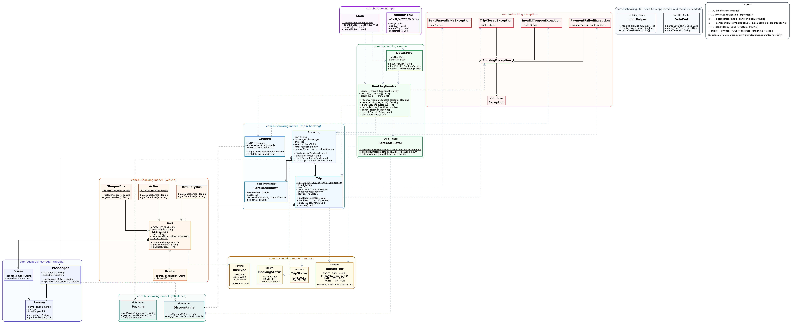

# Bus Ticket Booking System — V2 — Java OOP Mini Project

**REVA University · School of Applied Sciences · B.Sc. (BSTCs) · Semester V · Java Programming**

| Student name | SRN |
| --- | --- |
| _SATYAKAM TRIPATHY_ | _R24SA036_ |

## 1. What the program does

A console application for booking bus tickets. A `Bus` is the vehicle (route, usual daily departure time, driver,
seat count); a `Trip` is that bus running on one specific date, with its own seat map, so booking seat 5 on
Monday's bus no longer touches seat 5 on Tuesday's. A user can search trips by route, date or keyword and sort
them by departure time or fare; view a seat map; book seats (named or auto-assigned) with a senior/student
concession that stacks with an optional coupon code; pay (with change, or up to three retries); cancel for a
refund that depends on how close the departure is; look up bookings by phone number; and see system statistics.
Behind a password, an operator can add buses and trips, cancel a whole trip (refunding every passenger in full),
generate the schedule automatically, view a revenue report, and reset to the sample data. Every rule violation —
a taken seat, an expired coupon, underpaying, a trip that has already left — is reported through a custom checked
exception instead of a `null` or `false` return. All data is saved to disk after every change and reloaded on the
next run, and every booking is also exported as a standalone `.txt` ticket file.

This is version 2 of the project. Version 1 (a single-file-per-bus model with no dates, no exceptions, a flat
10% cancellation fee, and in-memory-only data) is not included here; see the version 2 upgrade list in section 5.

## 2. How to compile and run

```
javac -d out $(find src -name "*.java")          # Linux/macOS
javac -d out src\com\busbooking\**\*.java             # Windows (cmd)
java -cp out com.busbooking.app.Main
```
Works from any IDE too: import the `src` folder, run `com.busbooking.app.Main`.

Optional command-line flags (all can be combined):

| Flag | Effect |
| --- | --- |
| `--now 2026-10-05T19:30` | Freezes "now" to the given date/time, instead of the real clock. Without this, showing the 50% or 0% refund windows means waiting real hours; this makes every refund tier demonstrable on demand. `sample_output.txt` was captured with this flag. |
| `--data some/folder/file.dat` | Use a save file somewhere other than the default `data/busbooking.dat` (its tickets go in `some/folder/tickets/`). Handy for keeping a demo run separate from real data. |
| `--echo` | Print every line typed back to the screen. Only useful when input is piped in from a file (redirected input is not shown by the terminal on its own); this is how `sample_output.txt` was captured. |

The very first run (no save file yet) creates `data/busbooking.dat` and loads the sample fleet, drivers and a
week of trips automatically. Every later run picks up exactly where the last one left off. The admin password
is `admin123` (menu option 7 from the main menu).

## 3. Package layout

```
com.busbooking.model      BusType, BookingStatus, TripStatus, RefundTier (enums) · Payable, Discountable (interfaces)
                           Person → Passenger, Driver · Bus (abstract) → OrdinaryBus, AcBus, SleeperBus
                           Trip · Route · Booking · Coupon · FareBreakdown
com.busbooking.exception  BookingException (checked) → SeatUnavailableException, PaymentFailedException,
                           InvalidCouponException, TripClosedException
com.busbooking.service    BookingService (business logic) · FareCalculator (final utility class) · DataStore (save/load)
com.busbooking.util       InputHelper (console input) · DateFmt (date/time parsing & formatting)
com.busbooking.app        Main (menu loop) · AdminMenu (password-gated operator menu)
```
30 source files, ~3,160 lines.

## 4. Version 2 upgrades

| # | Upgrade | What changed | Where |
| --- | --- | --- | --- |
| 1 | **Trips with real dates** | `Bus` (the vehicle) and `Trip` (that bus on one date) are now separate classes. Each `Trip` owns its own seat-availability array, so the same bus can run on many dates without their bookings colliding. Search takes an optional date; results sort by `Trip.BY_DEPARTURE` or `Trip.BY_FARE`. | `Trip.java`:18<br>`BookingService.java`:216, 306, 360 |
| 2 | **Custom exceptions** | A new `exception` package: `BookingException` (checked, extends `Exception`) is the base of `SeatUnavailableException`, `PaymentFailedException`, `InvalidCouponException`, `TripClosedException`. Every V1 `null`/`false` failure return now `throw`s one of these; `Main`'s booking flow wraps the pay-and-save step in `try/catch/finally` so seats already held are always released if anything goes wrong. | `Coupon.java`:48<br>`Trip.java`:50, 134<br>`Booking.java`:121<br>`Main.java` (bookTicket) |
| 3 | **Time-based refunds** | `RefundTier` enum (`EARLY` 90% ≥48h, `STANDARD` 75% 12–48h, `LATE` 50% 2–12h, `NONE` 0% <2h) picks a tier from the exact minutes left before departure. `Trip.ensureOpen()` throws `TripClosedException` if the bus has already left or the trip was cancelled, blocking both booking and cancelling. | `RefundTier.java`:7<br>`TripClosedException.java`:4<br>`FareCalculator.java`:41<br>`BookingService.java`:521 |
| 4 | **Coupon codes** | `Coupon implements Discountable`, the same interface `Passenger` uses for its concession, so `FareCalculator.breakdown()` takes both and applies them in sequence: base fare → concession → coupon (capped, on the reduced amount) → 5% GST. `FareBreakdown` is a small immutable value class that itemises the result. | `Coupon.java`:14<br>`FareBreakdown.java`:9<br>`InvalidCouponException.java`:4<br>`FareCalculator.java`:30 |
| 5 | **Admin mode** | `AdminMenu`, reached from the main menu behind a password (`admin123`, 3 attempts): add a bus, add a trip, cancel a trip (every confirmed booking on it is refunded in full via `Booking.markTripCancelled()`), generate the schedule for the next *N* days, a revenue report broken down by bus, and reset to the sample data. | `Booking.java`:88<br>`AdminMenu.java`:25<br>`BookingService.java`:562, 574, 675 |
| 6 | **Save and load** | `DataStore` serializes the whole `BookingService` to `data/busbooking.dat` after every change (written to a temp file first, then moved into place, so a crash mid-save can't corrupt it) and reloads it on startup; a damaged save file is reported and set aside as `.corrupt` rather than crashing the program. Every booking is also written to `data/tickets/<PNR>.txt`. | `Main.java`:136<br>`DataStore.java`:25, 59, 79, 117 |
| 7 | **UML diagram + this README** | See section 7 below. |  |

## 5. What V1 looked like, for context

V1 modelled each `Bus` object as a single, permanently-scheduled trip (so seat availability was really per-bus,
not per-date), had no `exception` package (an unrecognised bus number or a full bus returned `null` or `false`),
charged a flat 10% cancellation fee at any time, had no coupons, no password-protected admin operations, and kept
all data in arrays that were discarded when the program exited. Every one of those is what section 4 replaces.

## 6. Traceability: mandatory feature → where it is implemented

The key implementation sites carry a `// [Fnn]` comment matching the first column (`// [V2-n]` for the version 2
extras in section 4), so `grep -rn "\[F07\]" src` lists every line. Line numbers are for the submitted files.

| # | Requirement | Implementation | File : line |
| --- | --- | --- | --- |
| 01 | ≥ 3–4 classes with encapsulation | Private fields + public getters/setters throughout `model`; e.g. `Route`, `Trip`, `Bus`, `Person`, `Booking` | `Route.java`:8<br>`Trip.java`:18<br>`Bus.java`:13<br>`Person.java`:13 |
| 02 | Data types, `final` constants, variable scope | `int/double/boolean/long/String/int[]/boolean[]`; constants `DEFAULT_SEATS`, `GST_RATE`; instance fields, a local variable scoped to one method, static counters | `Trip.java`:86<br>`Bus.java`:17<br>`Person.java`:13, 15, 18 |
| 03 | Operators + precedence-dependent expression | `amount * rate` capped before subtracting; `distance * rate + surcharge`; `(double) booked / total * 100` (cast binds tighter than `/`, `/` before `*`) | `Coupon.java`:59<br>`Trip.java`:100<br>`Passenger.java`:59<br>`FareCalculator.java`:34 |
| 04 | Type conversion / casting | `long → int` narrowing in `toWholeRupees`; `int → double` widening for an occupancy percentage | `Trip.java`:100<br>`FareCalculator.java`:53<br>`BookingService.java`:653 |
| 05 | Enum | `BookingStatus`, `BusType`, `RefundTier` (fields + constructor + static lookup method), `TripStatus` | `BookingStatus.java`:4<br>`BusType.java`:6<br>`RefundTier.java`:7<br>`TripStatus.java`:4 |
| 06 | Control flow + `break` / `continue` / `return` | `if-else`, `switch`, `for`, for-each, `while`, `do-while` across the seat map, refund-tier lookup, menu loop and statistics | `Trip.java`:62, 65, 87<br>`RefundTier.java`:40, 42 |
| 07 | Arrays of objects | `Bus[]`, `Trip[]`, `Booking[]`, `Person[]`, `Coupon[]` in `BookingService` (grown with `Arrays.copyOf`); `int[]` seat numbers in `Booking` | `Booking.java`:21<br>`BookingService.java`:49 |
| 08 | Console I/O + formatted output | `Scanner` in `InputHelper`; `printf`/`String.format` throughout for tables, the fare summary and the ticket | `Person.java`:72<br>`InputHelper.java`:10<br>`Main.java`:332 |
| 09 | Constructor overloading (default + parameterised) | `Route`, `Trip`, `Driver`, `Bus`, `Passenger`, `DataStore` each have 2+ constructors | `Route.java`:16, 20<br>`Trip.java`:34<br>`Driver.java`:13<br>`Bus.java`:27 |
| 10 | Method overloading | `Trip.bookSeat(int)` / `bookSeat()`; `BookingService.reserve(...)` in four forms and `searchTrips(...)` in four forms; `FareCalculator.breakdown(...)`/`refundAmount(...)`; `InputHelper.readInt(...)` | `Trip.java`:50, 61<br>`InputHelper.java`:46, 57<br>`FareCalculator.java`:21 |
| 11 | Static fields / methods | Counters `Person.totalPeople`, `Bus.totalBuses`, `Passenger.passengerCounter`, `Booking.bookingCounter` + their static getters (and `restore...` setters used after loading a save file) | `Bus.java`:18, 85<br>`Passenger.java`:10<br>`Person.java`:18, 75 |
| 12 | `this` reference | Shadowing (`this.tripId = tripId`) and constructor chaining `this(...)` | `Trip.java`:35, 40<br>`Bus.java`:28, 32<br>`Passenger.java`:15 |
| 13 | String class methods | `equalsIgnoreCase`, `trim`, `split`, `matches`, `equals` | `Route.java`:64<br>`Person.java`:37<br>`InputHelper.java`:24, 103, 119 |
| 14 | Base class + ≥ 2 subclasses | `Person → Passenger, Driver`; `Bus → OrdinaryBus, AcBus, SleeperBus`; `BookingException → 4 subclasses` | `Driver.java`:6<br>`OrdinaryBus.java`:6<br>`Passenger.java`:6<br>`Person.java`:8 |
| 15 | `super` (constructor + method) | `super(...)` in every subclass constructor; `super.describe()` in `Passenger`/`Driver` | `Driver.java`:20, 48<br>`OrdinaryBus.java`:11<br>`Passenger.java`:23, 69 |
| 16 | Overriding + dynamic binding | `Person p = people[i]; p.describe()`; `Trip.getFare()` calling `bus.calculateFare()` runs the correct subclass version at run time | `Trip.java`:180<br>`Driver.java`:42, 47<br>`OrdinaryBus.java`:15, 20 |
| 17 | Abstract class + abstract method | `Bus` (abstract) with abstract `calculateFare()` and `getAmenities()` | `Bus.java`:13, 42, 45 |
| 18 | Interface via interface reference | `Payable` (← `Booking`), `Discountable` (← `Passenger` **and** `Coupon`); `Payable payable = booking;` `Discountable concession = booking.getPassenger();` | `Coupon.java`:14<br>`Discountable.java`:6<br>`Booking.java`:12<br>`Main.java`:337 |
| 19 | `toString()` / `equals()` overriding | `Coupon`, `Trip`, `Bus`, `Booking`, `Person`, `Route` | `Coupon.java`:64, 70<br>`Trip.java`:186, 193<br>`Bus.java`:94 |
| 20 | `final` method / class with comment | `final` method `Booking.getPnr()`; `final` classes `FareBreakdown` and `FareCalculator` (reason in comment) | `FareBreakdown.java`:9<br>`Booking.java`:45<br>`FareCalculator.java`:11 |
| 21 | ≥ 2 custom packages + imports | `com.busbooking.model`, `.exception`, `.service`, `.util`, `.app`; explicit cross-package imports throughout | `Person.java`:1<br>`InputHelper.java`:1<br>`BookingException.java`:1<br>`Main.java`:1, 25 |

## 7. UML class diagram

`docs/uml_class_diagram.png` (also provided as a vector `.svg` and its Graphviz `.dot` source, for editing).
It covers every class, interface, enum and exception across all five packages, colour-coded by package, with a
legend for inheritance, interface realization, aggregation, composition and dependency. Two relationships worth
noting because they're easy to get backwards: a `Trip` holds a reference to one `Bus` (aggregation, diamond at
`Trip`), and a `Booking` owns its `FareBreakdown` outright (composition, diamond at `Booking`) since a fare
breakdown has no meaning outside the one booking it was computed for.



## 8. Sample output

See `sample_output.txt` — real captured output (not hand-written) from three runs: a customer session (search
and sort, seat maps, all five exceptions triggered live, coupon-and-concession stacking, all four refund tiers),
an admin session continuing from the same saved data (adding a bus and trip, generating a schedule, cancelling a
whole trip and seeing both affected passengers refunded automatically, two revenue reports to compare before and
after), and two genuine restarts of the program in separate processes — one showing the saved data reload
correctly, one showing a deliberately-corrupted save file recovered from gracefully.

## 9. Simplifications and known limitations

* Data is serialized with plain Java serialization (`ObjectOutputStream`), not a database or a text format; the
  save file is only readable by this program, and adding/removing a field from a saved-over class between runs
  can break an old save file (this is normal for `ObjectOutputStream` and not specific to this project).
* The admin password is a constant in the source (`AdminMenu.ADMIN_PASSWORD`) rather than hashed or externally
  configured, to keep the project focused on the OOP requirements above.
* A concession or coupon applies to the whole booking at once (one passenger's status), not seat-by-seat, matching
  how the V1 base this was built on already worked.
* Refund tiers use fixed boundaries agreed in the brief (48h/12h/2h); there's no manual override for, say, a
  medical emergency — that would be a reasonable V3 feature.
* This was exercised with an extensive scripted regression check during development (175 automated assertions
  covering every refund boundary, every exception path, save/load round-trips including object-identity checks,
  and counter recovery after a reload) as well as the manual sessions in `sample_output.txt`; the test harness
  itself isn't part of this submission, only the application code the brief asked for.
